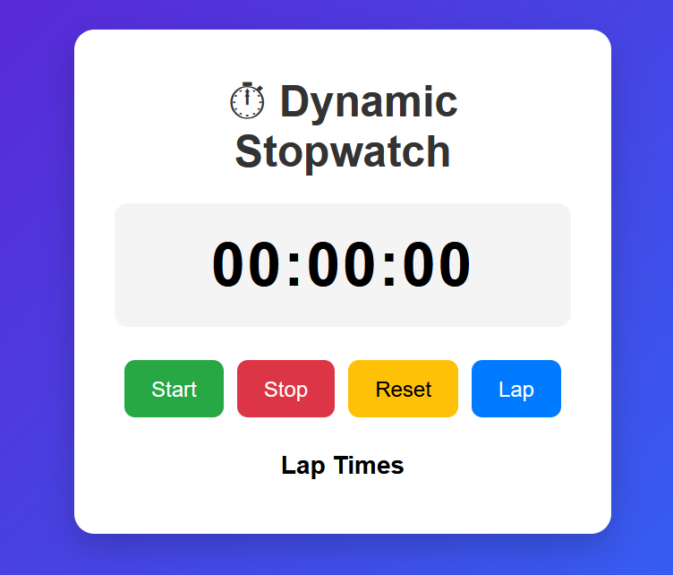

# Web-interface-Unit-1-project-
1.Dynamic Stopwatch

A simple and responsive stopwatch web application built using **HTML**, **CSS**, and **JavaScript**. It allows users to measure elapsed time accurately and record lap times with an easy-to-use interface.

##  Features

- ▶️ Start the stopwatch
- ⏸️ Stop/Pause the stopwatch
- 🔄 Reset the stopwatch
- 🏁 Record unlimited lap times
- 📱 Responsive design
- 🎨 Modern gradient UI
- ## 📸 Preview

